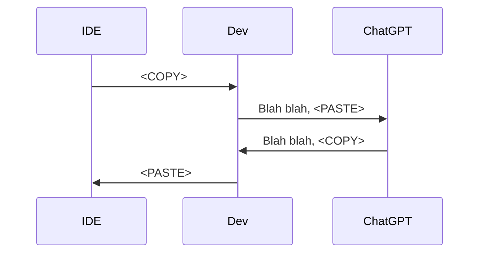
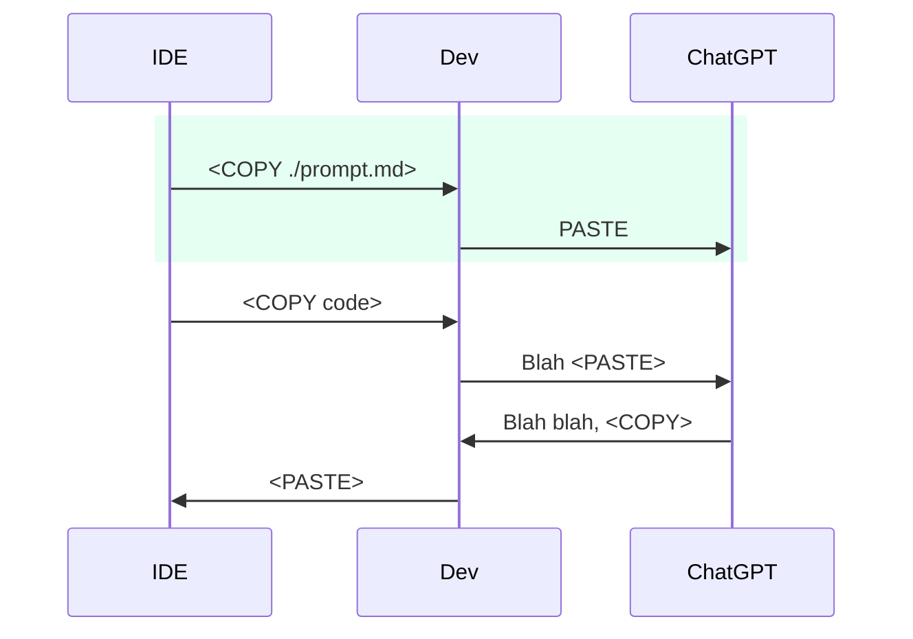

## AI Assisted Coding Stages

::left::

### Stage 1

```mermaid
sequenceDiagram
    IDE->>Dev: <COPY>
    Dev->>ChatGPT: Blah blah, <PASTE>
    ChatGPT->>Dev: Blah blah, <COPY>
    Dev ->>IDE: <PASTE>
```

::right::

### Stage 2

```mermaid
sequenceDiagram
    rect rgba(0, 255, 127, .1)
    IDE->>Dev: <COPY ./prompt.md>
    Dev->>ChatGPT: PASTE
    end
    IDE->>Dev: <COPY code>
    Dev->>ChatGPT: Blah <PASTE>
    ChatGPT->>Dev: Blah blah, <COPY>
    Dev ->>IDE: <PASTE>
```
