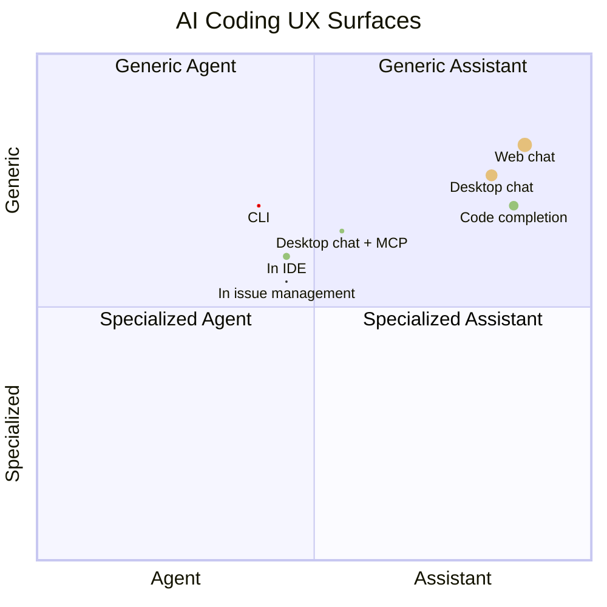

## The Spectrum of AI Assisted Coding

 
 
 

- Agent v.s. Assistant
- Specialized v.s. Generic

  Size: popularity | 🟢: recommended | 🟡: evaluated | 🔴: not recommended

::right::

```mermaid
quadrantChart

title AI Coding UX Surfaces

	x-axis Agent --> Assistant
	y-axis Specialized --> Generic

	quadrant-1 Generic Assistant
	quadrant-2 Generic Agent
	quadrant-3 Specialized Agent
	quadrant-4 Specialized Assistant

	Web chat: [0.88, 0.82] radius: 6, color: #E5C07B
	Desktop chat: [0.82, 0.76] radius: 5, color: #E5C07B
	Code completion: [0.86, 0.70] radius: 4, color: #98C379
	In IDE: [0.45, 0.60] radius: 3, color: #98C379
	Desktop chat + MCP: [0.55, 0.65] radius: 2, color: #98C379
	In issue management: [0.45, 0.55] radius: 1

	CLI: [0.4, 0.70] radius: 1, stroke-color: #f00, stroke-width: 1px
```
