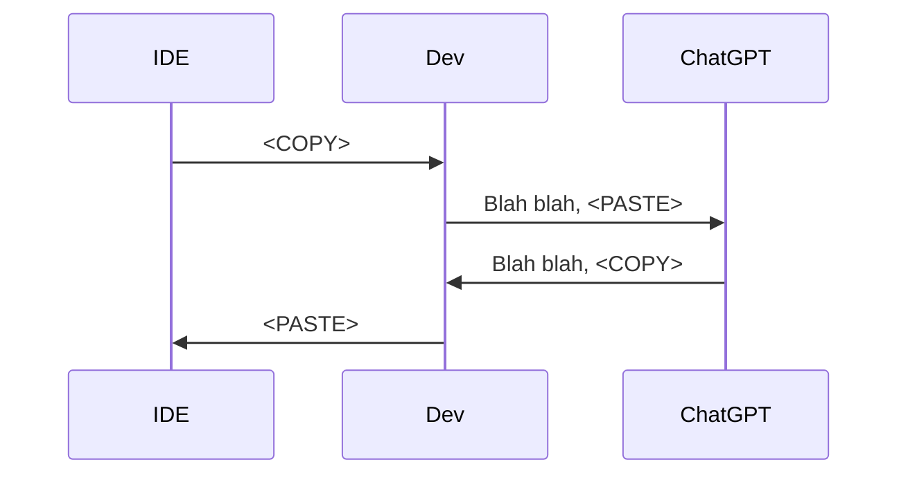
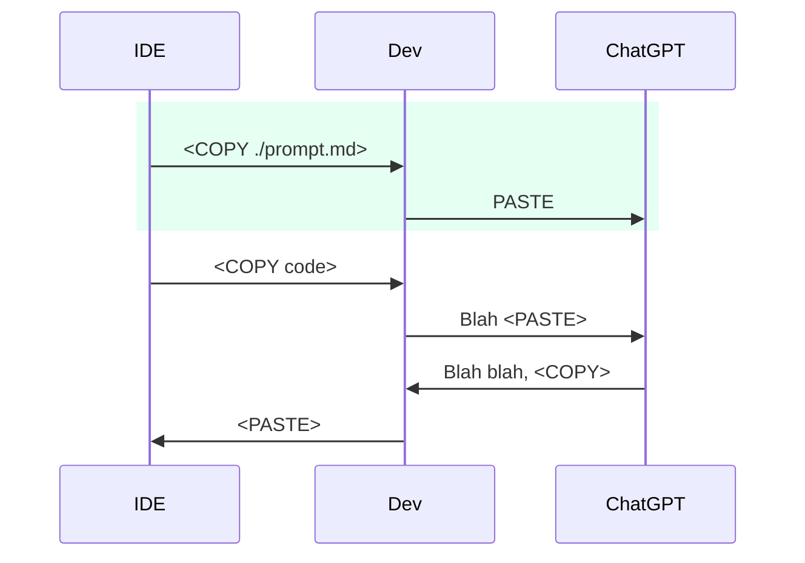
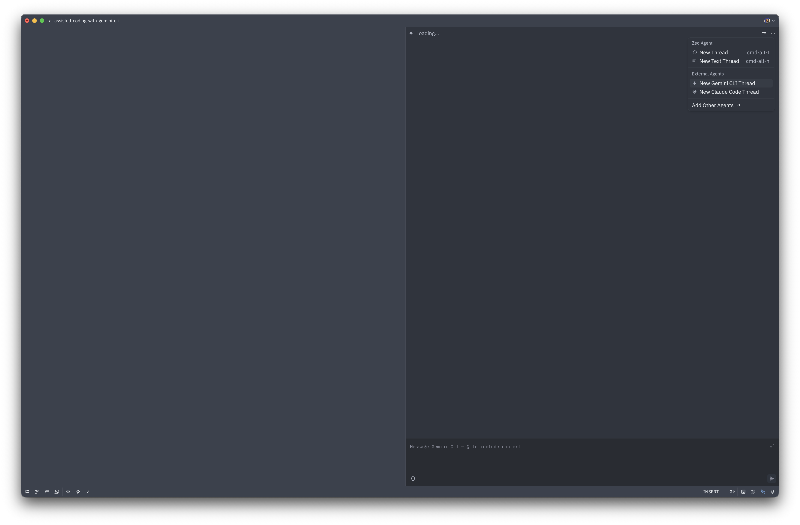

# Gemini CLI Evaluation and Training

---
src: pages/agenda.md
---

---
layout: section
---

# Part 1: Theory
For executives, managers, and leads

---
layout: statement
---

Quick Survey.
Rank these tools?
-

---
layout: two-cols-header
---

## AI Assisted Coding Stages

::left::

### Stage 1



::right::

### Stage 2



---
layout: two-cols-header
---

## AI Assisted Coding Stages
### Stage 1 and 2 Examples

::left::

Copy, Paste, Copy, Paste, Copy, Paste, Copy, Paste,
Copy, Paste, Copy, Paste, Copy, Paste, Copy, Paste,
Copy, Paste, Copy, Paste, Copy, Paste, Copy, Paste,
Copy, Paste, Copy, Paste, Copy, Paste, Copy, Paste,

Examples:
- ChatGPT

::right::

Insert selection, insert code, Insert selection, insert code
Insert selection, insert code, Insert selection, insert code
Insert selection, insert code, Insert selection, insert code
Insert selection, insert code, Insert selection, insert code

Examples:
- Co-pilot Chat Mode

---
layout: two-cols
---

## The Spectrum of AI Assisted Coding

<br/>
<br/>
<br/>

- Agent v.s. Assistant
- Specialized v.s. Generic


<div class="absolute right-30px bottom-30px font-size-2">
  Size: popularity | 🟢: recommended | 🟡: evaluated | 🔴: not recommended
</div>

::right::


---
layout: two-cols
---

## So where is Gemini CLI

### Pros 👍

- Free quota with Google Workspace
- Great for getting started with CLI tools
- Good features: memory, init, commands, MCP... etc

### Cons 👎

- Below average code quality
- Easy to lose chat history
- Can delete files and lie

::right::


---
layout: two-cols
---

## Free Quata
<br/>
<br/>
<br/>
Outside of free quata, a feature could rack up to $50

if the AI struggles or the feature is too big.


<span v-mark.underline.red>It is not free labour</span>.


::right::

It is why Pro plans are in $100s

| Service           | Premium plan(s)                                                 |
|-------------------|-----------------------------------------------------------------|
| Anthropic Claude  | Pro $18/mo · Max from $100/mo                                   |
| OpenAI ChatGPT    | Plus $20/mo · Pro $200/mo                                       |
| Google (Gemini)   | AI Pro $19.99/mo · AI Ultra $249.99/mo                          |
| xAI Grok (via X)  | X Premium+ ~$40/mo (web); higher SuperGrok tiers up to ~$300/mo |

---
layout: quote
---

## Use Gemini CLI as a way to get into CLI based agents.


---
layout: section
---

# Part 2: Practical
For managers, leads, and engineers


---
layout: image-right
image: ../assets/barriers.png
---

## Objectives

Overcome:

- Activation friction
- Cognitive overload
- Time poverty

---

## Getting Started
### Installation

````md magic-move
```shell
> npm install -g @google/gemini-cli
```
```shell
> npm install -g @google/gemini-cli

added 66 packages, removed 25 packages, and changed 417 packages in 25s

150 packages are looking for funding
  run `npm fund` for details
```
```shell
> gemini
```
```shell

 ███            █████████  ██████████ ██████   ██████ █████ ██████   █████ █████
░░░███         ███░░░░░███░░███░░░░░█░░██████ ██████ ░░███ ░░██████ ░░███ ░░███
  ░░░███      ███     ░░░  ░███  █ ░  ░███░█████░███  ░███  ░███░███ ░███  ░███
    ░░░███   ░███          ░██████    ░███░░███ ░███  ░███  ░███░░███░███  ░███
     ███░    ░███    █████ ░███░░█    ░███ ░░░  ░███  ░███  ░███ ░░██████  ░███
   ███░      ░░███  ░░███  ░███ ░   █ ░███      ░███  ░███  ░███  ░░█████  ░███
 ███░         ░░█████████  ██████████ █████     █████ █████ █████  ░░█████ █████
░░░            ░░░░░░░░░  ░░░░░░░░░░ ░░░░░     ░░░░░ ░░░░░ ░░░░░    ░░░░░ ░░░░░

Tips for getting started:
1. Ask questions, edit files, or run commands.
2. Be specific for the best results.
3. /help for more information.

Using: 2 GEMINI.md files | 2 MCP servers (ctrl+t to view)
╭─────────────────────────────────────────────────────────────────────────────────────────────────────────────────────────────────────────────────────────────────────────────────────────────────────────────────────────────────────────────────────────────────────────────────────╮
│ >   Press 'i' for INSERT mode and 'Esc' for NORMAL mode.                                                                                                                                                                                                                            │
╰─────────────────────────────────────────────────────────────────────────────────────────────────────────────────────────────────────────────────────────────────────────────────────────────────────────────────────────────────────────────────────────────────────────────────────╯
```
```shell
╭───────────╮
│  > /auth  │
╰───────────╯

╭─────────────────────────────────────────────────────────────────────────────────────────────────────────────────────────────────────────────────────────────────────────────────────────────────────────────────────────────────────────────────────────────────────────────────────╮
│                                                                                                                                                                                                                                                                                     │
│ Get started                                                                                                                                                                                                                                                                         │
│                                                                                                                                                                                                                                                                                     │
│ How would you like to authenticate for this project?                                                                                                                                                                                                                                │
│                                                                                                                                                                                                                                                                                     │
│ ● 1. Login with Google                                                                                                                                                                                                                                                              │
│   2. Use Gemini API Key                                                                                                                                                                                                                                                             │
│   3. Vertex AI                                                                                                                                                                                                                                                                      │
│                                                                                                                                                                                                                                                                                     │
│ Existing API key detected (GEMINI_API_KEY). Select "Gemini API Key" option to use it.                                                                                                                                                                                               │
│                                                                                                                                                                                                                                                                                     │
│ (Use Enter to select)                                                                                                                                                                                                                                                               │
│                                                                                                                                                                                                                                                                                     │
│ Terms of Services and Privacy Notice for Gemini CLI                                                                                                                                                                                                                                 │
│                                                                                                                                                                                                                                                                                     │
│ https://github.com/google-gemini/gemini-cli/blob/main/docs/tos-privacy.md                                                                                                                                                                                                           │
│                                                                                                                                                                                                                                                                                     │
╰─────────────────────────────────────────────────────────────────────────────────────────────────────────────────────────────────────────────────────────────────────────────────────────────────────────────────────────────────────────────────────────────────────────────────────╯
```
````

---

### Web Login


---

### Intialization

```sh
███            █████████  ██████████ ██████   ██████ █████ ██████   █████ █████
░░░███         ███░░░░░███░░███░░░░░█░░██████ ██████ ░░███ ░░██████ ░░███ ░░███
 ░░░███      ███     ░░░  ░███  █ ░  ░███░█████░███  ░███  ░███░███ ░███  ░███
   ░░░███   ░███          ░██████    ░███░░███ ░███  ░███  ░███░░███░███  ░███
    ███░    ░███    █████ ░███░░█    ░███ ░░░  ░███  ░███  ░███ ░░██████  ░███
  ███░      ░░███  ░░███  ░███ ░   █ ░███      ░███  ░███  ░███  ░░█████  ░███
███░         ░░█████████  ██████████ █████     █████ █████ █████  ░░█████ █████
░░░            ░░░░░░░░░  ░░░░░░░░░░ ░░░░░     ░░░░░ ░░░░░ ░░░░░    ░░░░░ ░░░░░

Tips for getting started:
1. Ask questions, edit files, or run commands.
2. Be specific for the best results.
3. /help for more information.

Using: 2 GEMINI.md files | 2 MCP servers (ctrl+t to view)
╭─────────────────────────────────────────────────────────────────────────────────────────────╮
│ > /init                                                                                     │
╰─────────────────────────────────────────────────────────────────────────────────────────────╯
```

---
layout: image-right
image: ./assets/activation-friction-defeated.png
---

## Congratulations 🎉
You have defeated activation friction

---
src: pages/how-to-use-1.md
---

---
src: pages/how-to-use-2.md
---

---
layout: image-right
image: assets/cognitive-overload-defeated.png
---

## Congratulations 🎉
You have defeated cognitive overload

---
src: pages/overcome-time-poverty.md
---

---
layout: image-right
image: assets/time-poverty-defeated.png
---

## Congratulations 🎉
You have defeated Time Poverty


---
src: pages/optimize-context.md
---

---
src: pages/working-with-ui.md
---

---
src: pages/custom-commands.md
---

---
src: pages/parallel-sandbox.md
---

---
src: pages/handle-token-limit.md
---

---
layout: image-right
image: assets/acp.svg
backgroundSize: 20em 70%
---

## Working with IDEs

### Agent Client Protocol (ACP)

https://agentclientprotocol.com/overview/introduction

---
layout: full
---

## ACP in Zed IDE



---
## ACP in Zed

Click on `+` and select Gemini CLI

Only Zed
Future:
- VS Code
- NeuVim

---
