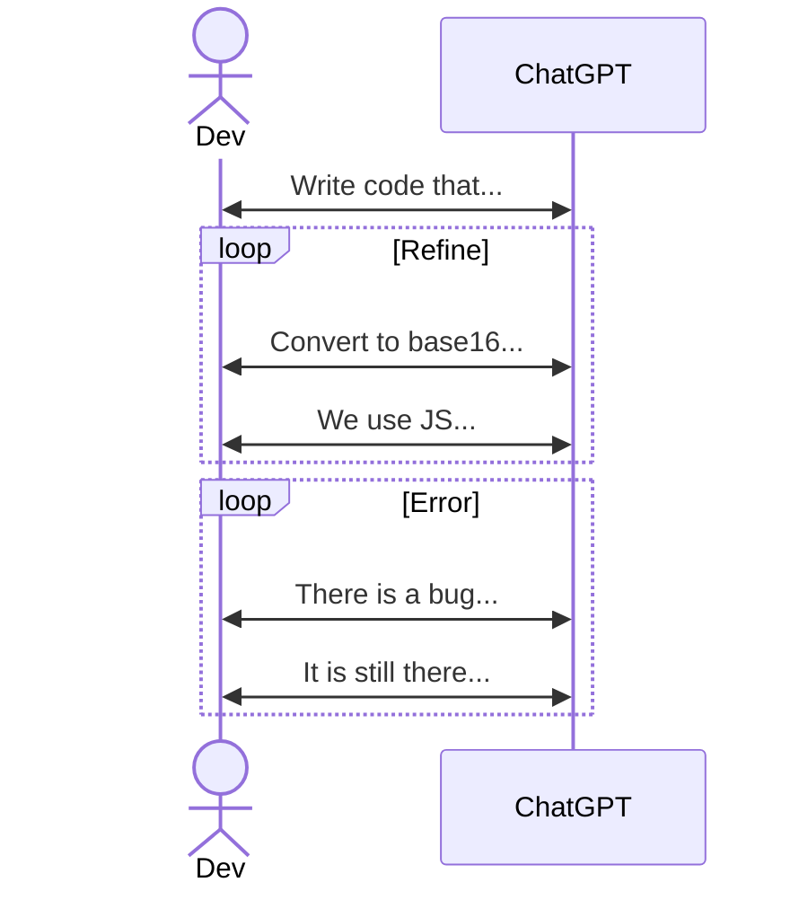
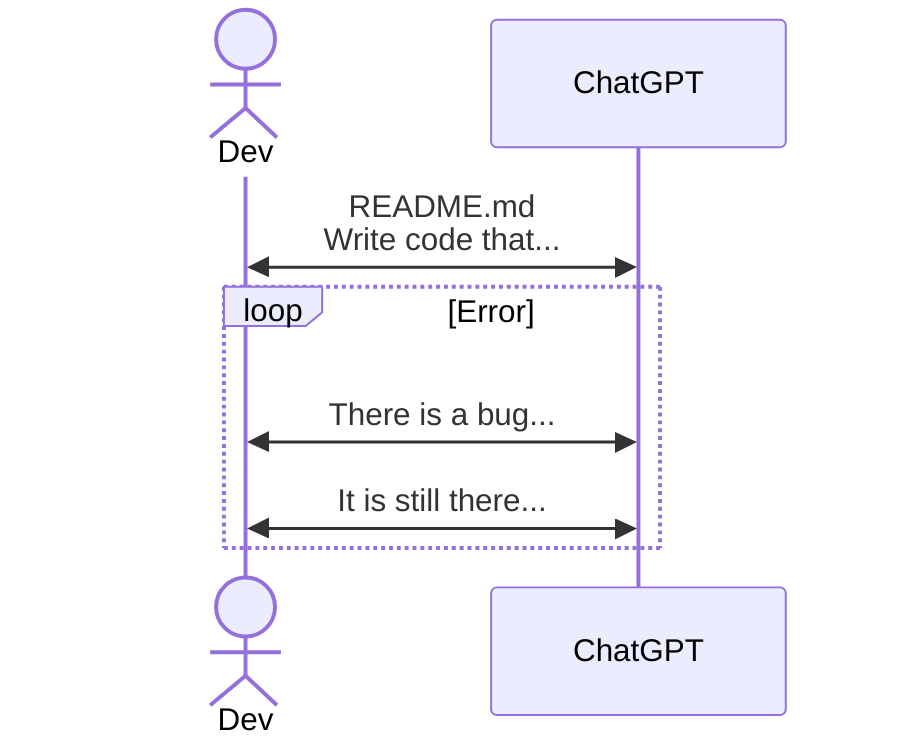

## Stages of Coding with AI: Assistant Stage

::left::

```mermaid
sequenceDiagram
    actor Dev
    Dev<<->>ChatGPT: Write code that...
    loop Refine
    Dev<<->>ChatGPT: Convert to base16...
    Dev<<->>ChatGPT: We use JS...
    end
    loop Error
    Dev<<->>ChatGPT: There is a bug...
    Dev<<->>ChatGPT: It is still there...
    end
```

::right::

```mermaid
sequenceDiagram
    actor Dev
    Dev<<->>ChatGPT: README.md <br/> Write code that...
    loop Error
    Dev<<->>ChatGPT: There is a bug...
    Dev<<->>ChatGPT: It is still there...
    end
```
