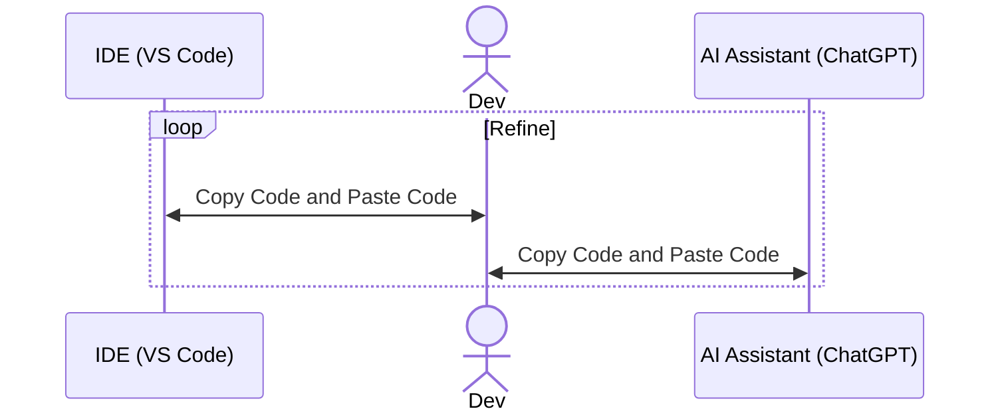

## Assistants Probelm

<strong v-click class="fixed top-1/2 left-1/2 -translate-x-1/2 -translate-y-1/2 z-[9999] text-red-600 text-6xl rotate-45">
  Still a lot of Copy and Paste and Window Switching
</strong>
