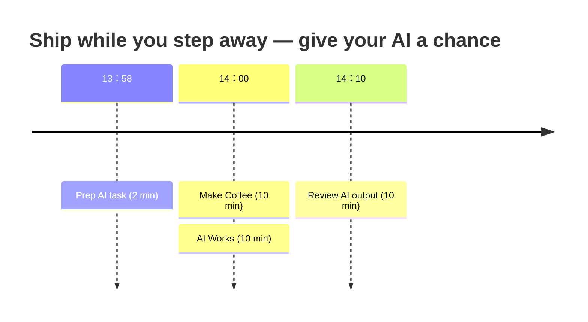

## Finding time

Ideas for a first task:

- Copy and paste a Jira issue
- Chore task:
  - Upgrade to latest Java
  - Upgrade all dependencies to latest
- Fix my broken build

::right::

Try to make it a daily habbit.
