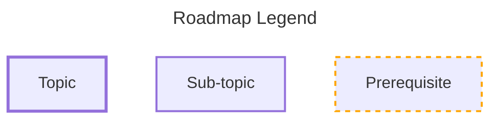
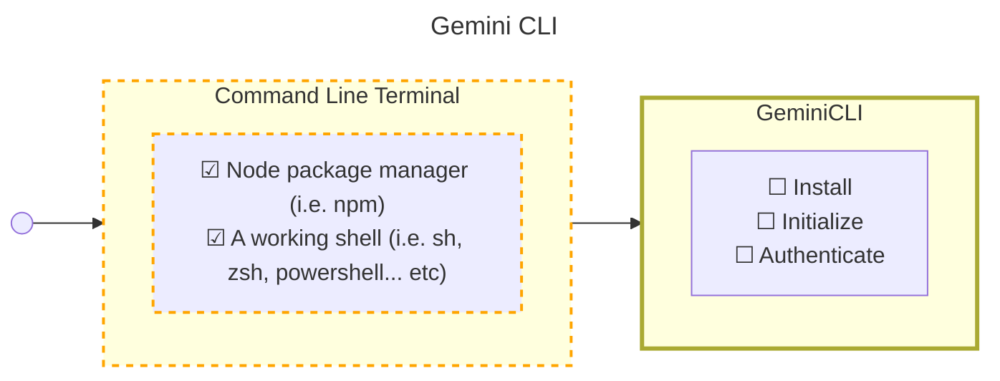

## Pre Requisite

```mermaid
---
title: Roadmap Legend
---

graph TD
    T["Topic"]:::topic
    ST["Sub-topic"]:::subTopic
    R["Prerequisite"]:::requisite

    classDef topic stroke-width:3px
    classDef subTopic stroke-width:2px
    classDef requisite stroke:#ffa500,stroke-width:2px,stroke-dasharray: 5 5
```

 
 

```mermaid
---
title: Gemini CLI
---

%% README
%% Use ☐ for - [ ]
%% Use ☑ for - [x]

graph LR

    Start((" ")) --> CLI

    subgraph CLI[Command Line Terminal]
        1["`☑ Node package manager (i.e. npm)
        ☑ A working shell (i.e. sh, zsh, powershell... etc)`"]:::requisite
    end

    CLI:::requisite --> GeminiCLI:::topic

    subgraph GeminiCLI
        2["`☐ Install
        ☐ Initialize
        ☐ Authenticate`"]
    end


    classDef topic stroke-width:3px
    classDef subTopic stroke-width:2px
    classDef requisite stroke:#ffa500,stroke-width:2px,stroke-dasharray: 5 5
```
