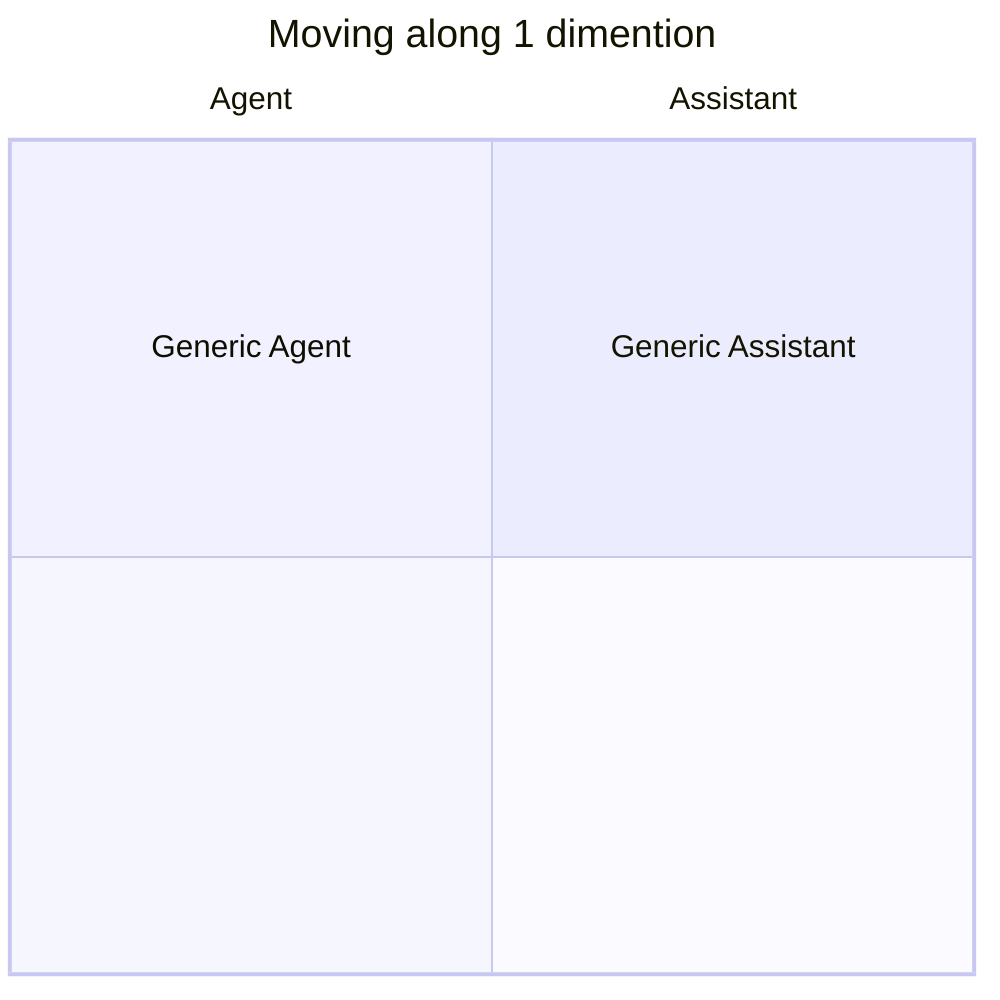

```mermaid
quadrantChart

title Moving along 1 dimention

	x-axis Agent --> Assistant

	quadrant-1 Generic Assistant
	quadrant-2 Generic Agent

```
<v-click>
<Arrow x1="550" y1="215" x2="450" y2="215" color="red" width="5" />
</v-click>
