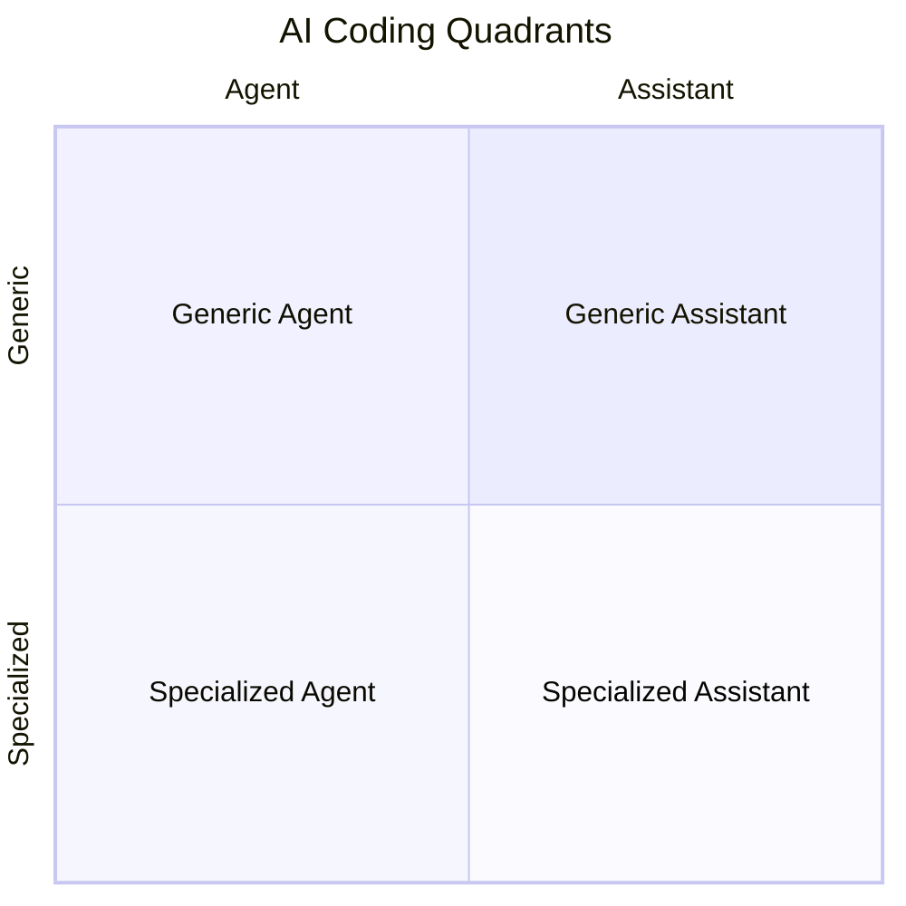

<Arrow x1="550" y1="215" x2="450" y2="215" color="red" width="5" />

<Arrow x1="550" y1="323" x2="450" y2="323" color="red" width="5" />

<Arrow x1="550" y1="430" x2="450" y2="430" color="red" width="5" />
