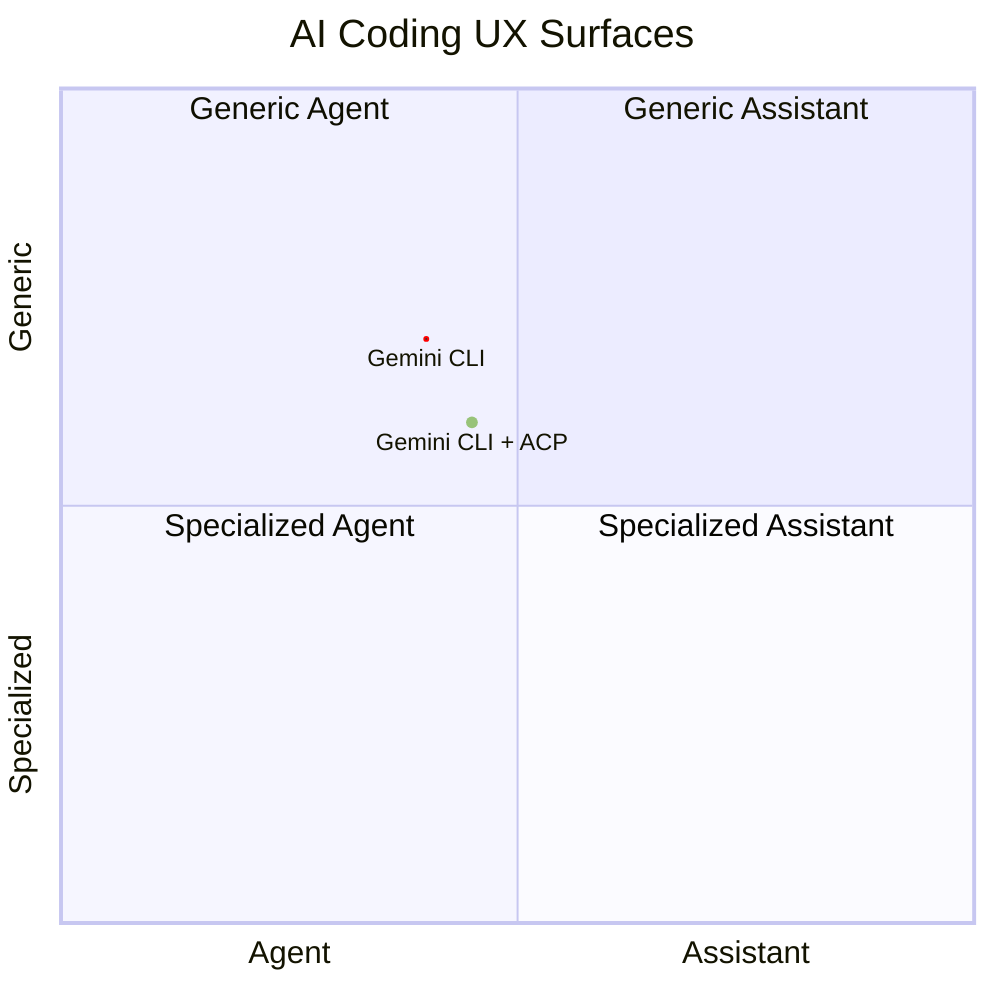

## So where is Gemini CLI

### Pros 👍

- **Free quota** with Google Workspace
- Great for getting started with CLI tools
- Good features: memory, init, commands, MCP... etc

### Cons 👎

- Below average code quality
- Easy to lose chat history
- Can delete files and lie

::right::

